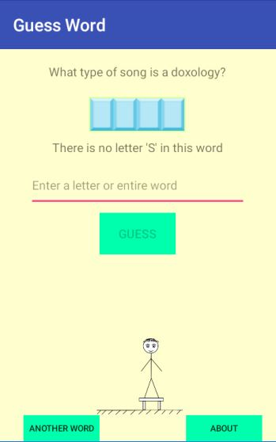
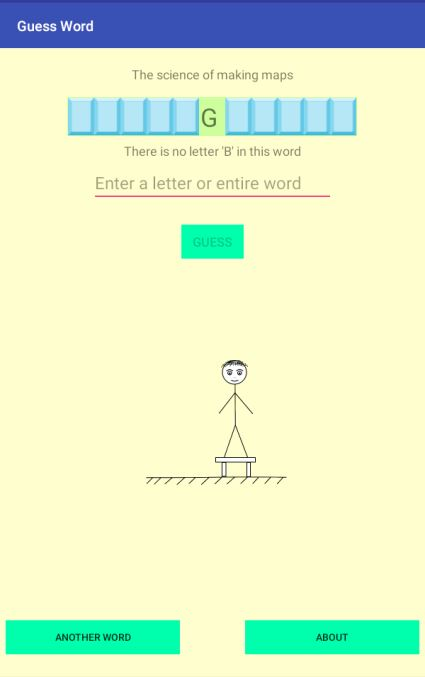

# GuessWord
Application for Android. 
Quiz, in which you must guess the word.
Minimal Android version: 4.0.3
Phones with a 480 x 800 screen, 7 and 10 inch tablets are supported.
The goal of the game is to guess the closed word.
You can guess both one-by-one letter and the whole word at once.

